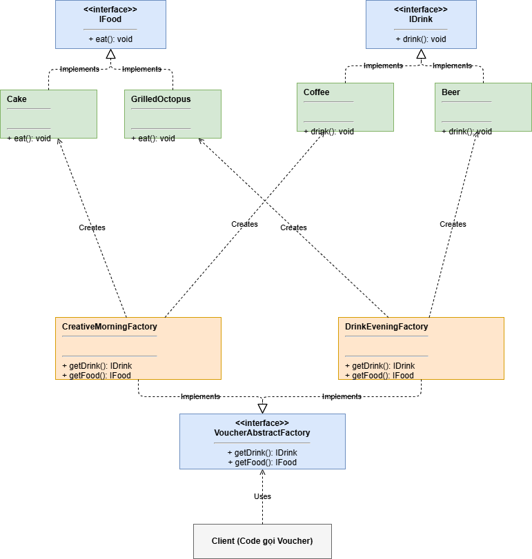
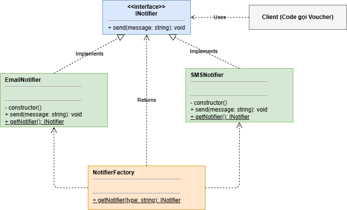
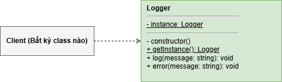

## 📋 Danh sách các Pattern được sử dụng

1. **Abstract Factory & Factory Method** (Hệ thống Voucher)
2. **Simple Factory & Dependency Injection** (Hệ thống Thông báo - Notification)
3. **Singleton** (Hệ thống Ghi log - Logger)

---

### 1. Hệ thống Voucher (Abstract Factory & Factory Method)

Hệ thống này xử lý việc tạo ra các combo ăn uống (Voucher) dựa trên các chiến dịch khác nhau mà không cần client phải biết chi tiết về từng món ăn hay đồ uống.

- **Abstract Factory (`VoucherAbstractFactory`):** Cung cấp một interface để tạo ra một "gia đình" các đối tượng có liên quan (Food và Drink) mà không cần chỉ định các lớp cụ thể của chúng.
- **Concrete Factories:** `CreativeMorningFactory` tạo ra bộ (Coffee + Cake), trong khi `DrinkEveningFactory` tạo ra bộ (Beer + GrilledOctopus).

- **Factory Method (bên trong class `Voucher`):** Phương thức tĩnh `getVoucher(campainName)` nhận vào tên chiến dịch và quyết định sử dụng Factory nào để khởi tạo Voucher. Client chỉ cần gọi phương thức này và nhận về một Voucher hoàn chỉnh.

### 2. Hệ thống Notification (Simple Factory & Dependency Injection)

Hệ thống này chịu trách nhiệm gửi thông báo cho người dùng thông qua các kênh khác nhau (SMS, Email).

- **Simple Factory (`NotifierFactory`):** Một "God class/function" chịu trách nhiệm quyết định xem nên khởi tạo lớp Notifier nào (`SMSNotifier` hay `EmailNotifier`) dựa trên chuỗi định dạng (type) được truyền vào.

### 3. Hệ thống Logger (Singleton)

Hệ thống này cung cấp một công cụ ghi chú (log) thông tin hệ thống.

- **Singleton (`Logger`):** Đảm bảo rằng chỉ có **duy nhất một instance** của class `Logger` được tạo ra trong suốt vòng đời của ứng dụng, đồng thời cung cấp một điểm truy cập toàn cục tới instance đó qua phương thức `getInstance()`.
- **Cách hoạt động:** Constructor của `Logger` được đặt ở trạng thái `private`. Khi gọi `Logger.getInstance()`, nó sẽ kiểm tra xem instance đã tồn tại chưa. Nếu chưa, nó khởi tạo mới; nếu có rồi, nó trả về instance cũ. Bằng chứng là `logger1 === logger2` sẽ trả về `true`.

---
