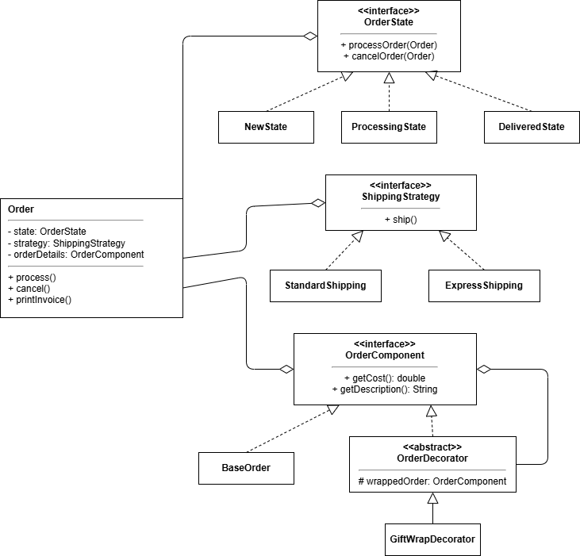
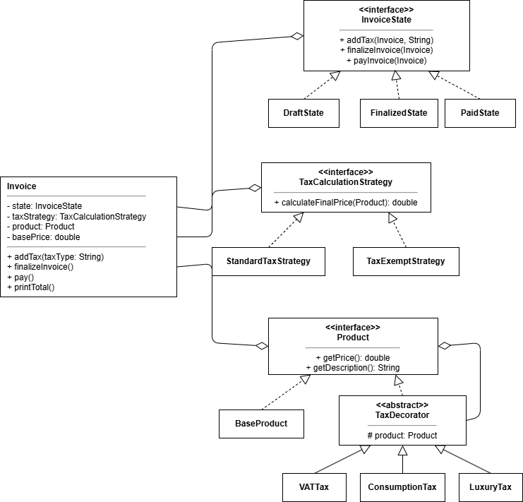
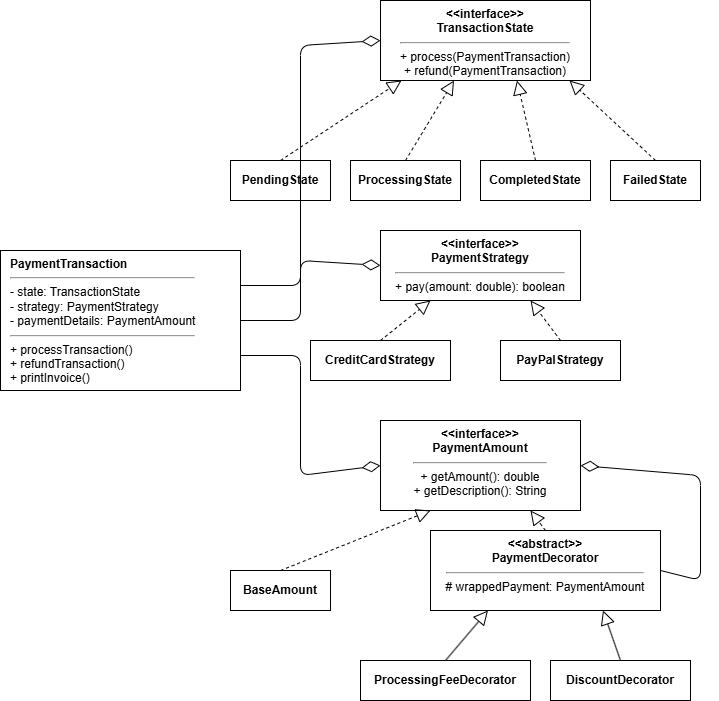
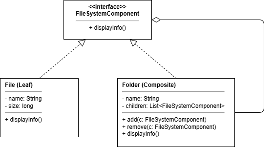
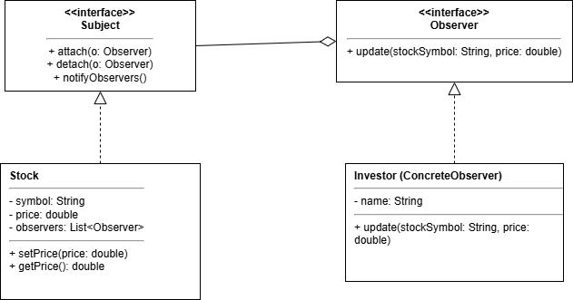
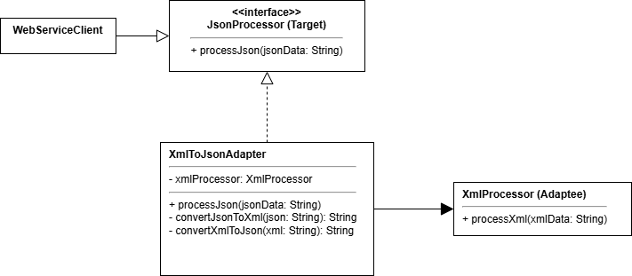
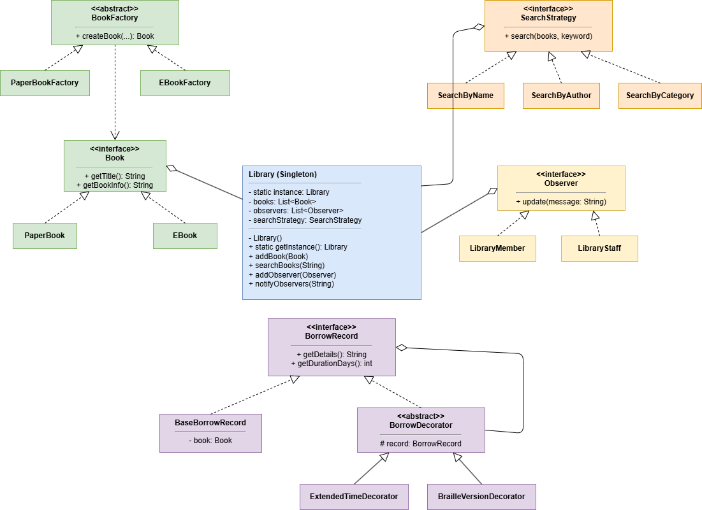

# 🚀 Demo Design Pattern - Order, Invoice, Payment, File, Stock, Adapter, Library

README này mô tả các demo theo đúng thứ tự:
**Order → Invoice → Payment → File → Stock → Adapter → Library**.

## 📚 Menu

- [1) Order System](#order-system)
- [2) Invoice System](#invoice-system)
- [3) Payment System](#payment-system)
- [4) File System](#file-system)
- [5) Stock System](#stock-system)
- [6) Adapter System](#adapter-system)
- [7) Library System](#library-system)

---

## 📦 1) Order System

### 🔎 Mô tả luồng xử lý

- Tạo đơn hàng với giá gốc **100 USD**.
- Áp dụng `GiftWrapDecorator` để cộng thêm **10 USD** (dịch vụ gói quà).
- Chọn chiến lược giao hàng `ExpressShipping`.
- In thông tin đơn hàng (`printInvoice`).
- Xử lý đơn hàng (`process`) theo State:
  - Chuyển từ `NewState` → `ProcessingState` và bắt đầu giao hàng nhanh.

- Thực hiện hủy đơn (`cancel`) tùy theo trạng thái hiện tại.

### 🧠 Design Pattern sử dụng

- **State**: Quản lý trạng thái đơn hàng (`New`, `Processing`, `Delivered`).
- **Strategy**: Lựa chọn phương thức giao hàng (`Standard`, `Express`).
- **Decorator**: Mở rộng chi phí đơn hàng (ví dụ: gói quà).

---

## 🧾 2) Invoice System

### 🔎 Mô tả luồng xử lý

- Tạo sản phẩm gốc: `Laptop` với giá **1000 USD**.
- Áp dụng nhiều lớp thuế bằng Decorator:
  - `VATTax` (+10%)
  - `LuxuryTax` (+20%)

- Gọi `addTax("VAT")` khi hóa đơn đang ở trạng thái `Draft`.
- Gọi `finalizeInvoice()` để chuyển sang trạng thái `Finalized`.
- Gọi `pay()` để thanh toán và chuyển sang trạng thái `Paid`.
- Gọi `printTotal()` để in tổng tiền cuối cùng theo `TaxCalculationStrategy`.

### 🧠 Design Pattern sử dụng

- **State**: Quản lý vòng đời hóa đơn (`Draft` → `Finalized` → `Paid`).
- **Strategy**: Cách tính tổng tiền (`StandardTaxStrategy`, `TaxExemptStrategy`).
- **Decorator**: Cộng dồn các lớp thuế trên cùng một sản phẩm.

---

## 💳 3) Payment System

### 🔎 Mô tả luồng xử lý

- Khởi tạo số tiền gốc **100 USD**.
- Áp dụng Decorator cho thanh toán:
  - `ProcessingFeeDecorator` (+5 USD)
  - `DiscountDecorator` (-10 USD)

- Chọn phương thức thanh toán `CreditCardStrategy`.
- In hóa đơn thanh toán (`printInvoice`).
- Xử lý giao dịch (`processTransaction`) theo State:
  - `Pending` → `Processing` (nếu thành công).

- Thực hiện hoàn tiền (`refundTransaction`) tùy theo trạng thái hiện tại.

### 🧠 Design Pattern sử dụng

- **State**: Quản lý trạng thái giao dịch (`Pending`, `Processing`, `Completed`, `Failed`).
- **Strategy**: Lựa chọn kênh thanh toán (`CreditCard`, `PayPal`).
- **Decorator**: Tính toán tổng tiền sau phí và giảm giá.

---

## 🗂️ 4) File System

### 🔎 Mô tả luồng xử lý

- Tạo các đối tượng file: `document.txt`, `image.png`, `video.mp4`.
- Tạo cây thư mục gồm `Root` và `SubFolder`.
- Thêm `document.txt` vào `Root`.
- Thêm `image.png` và `video.mp4` vào `SubFolder`, sau đó thêm `SubFolder` vào `Root`.
- Gọi `root.displayInfo()` để in toàn bộ cấu trúc file/thư mục theo dạng phân cấp.

### 🧠 Design Pattern sử dụng

- **Composite**: Gom `File` và `Folder` dưới cùng interface `FileSystemComponent` để xử lý thống nhất.

---

## 📈 5) Stock System

### 🔎 Mô tả luồng xử lý

- Khởi tạo cổ phiếu `AAPL` giá ban đầu **150**.
- Tạo 2 nhà đầu tư: `Alice`, `Bob`.
- Đăng ký cả hai observer vào stock (`attach`).
- Khi giá đổi sang **155** rồi **160**, tất cả observer nhận thông báo.
- Hủy đăng ký `Alice` (`detach`).
- Cập nhật giá lên **170**: chỉ còn `Bob` nhận thông báo.

### 🧠 Design Pattern sử dụng

- **Observer**: `Stock` đóng vai Subject, `Investor` là Observer nhận cập nhật khi giá thay đổi.

---

## 🔌 6) Adapter System

### 🔎 Mô tả luồng xử lý

- Hệ thống client cần interface `JsonProcessor`.
- Thành phần sẵn có là `XmlProcessor` chỉ hiểu dữ liệu XML.
- Dùng `XmlToJsonAdapter` để chuyển dữ liệu JSON sang XML trước khi xử lý.
- Client gọi `processJson(...)` như bình thường, adapter chịu trách nhiệm chuyển đổi định dạng.

### 🧠 Design Pattern sử dụng

- **Adapter**: Bọc `XmlProcessor` để tương thích với interface `JsonProcessor` mà không cần sửa code cũ.

---

## 📚 7) Library System

### 🔎 Mô tả luồng xử lý

- Lấy instance thư viện duy nhất bằng `Library.getInstance()`.
- Tạo sách bằng factory:
  - `PaperBookFactory` tạo sách giấy.
  - `EBookFactory` tạo sách điện tử.
- Thêm sách vào thư viện và đăng ký người nhận thông báo (`LibraryMember`, `LibraryStaff`).
- Chọn chiến lược tìm kiếm `SearchByName`, sau đó tìm sách theo từ khóa.
- Tạo `BorrowRecord` và mở rộng bằng Decorator:
  - `ExtendedTimeDecorator` (gia hạn thời gian mượn)
  - `BrailleVersionDecorator` (phiên bản Braille)
- Gửi thông báo đến toàn bộ observer bằng `notifyObservers(...)`.

### 🧠 Design Pattern sử dụng

- **Singleton**: `Library` chỉ có một instance toàn cục.
- **Factory Method**: Tách logic tạo `PaperBook` và `EBook`.
- **Strategy**: Linh hoạt đổi cách tìm kiếm sách.
- **Observer**: Thành viên/nhân viên nhận thông báo từ thư viện.
- **Decorator**: Mở rộng thông tin và thời hạn mượn sách.
